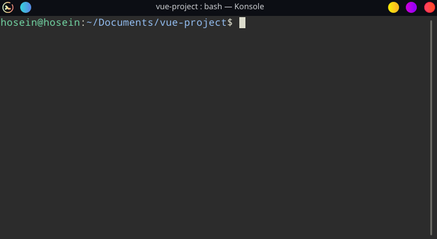

# Gue   [](https://travis-ci.org/hosein2398/gue) 

> Vue js component generator

<p align="center">
  
</p>


Features
* 📜 Generate Vue component
* 🧰 Generate test file for the component 
* ⚙️ Dynamic path for component
* 📁 Configurable root directory for components and tests
* 📝 Custom templates for components and test
## Installing
> Note that this package is published under name of `vue-gue`
```
npm i -g vue-gue
```

## Getting started
Head over to root of your project in terminal, say you want to create a component named `footer`:
```
gue footer
```
This will generate `footer` component in `./src/components/footer.vue`
#### Change directory of component
You can define a directory which you want your component to be generated in.
```
gue tab ./menu
```
This will generate `tab` component in `./menu/tab.vue`
> Consider behavior of directory parameter when you have a config file and you don't. [details](#usage)
> For a consistent way to change root directory of components see  [config](#config-file).

#### Generate test file
Now if you want a component and also it's corresponding unit test file you can do:
```
gue footer -u
```
This will generate `footer` component in `./src/components/footer.vue` and also a test file in `./tests/unit/footer.js`
> To change any of these directories see [config](#config-file)
## Usage
General usage is like:
```
gue <componentName> [directory] [options]
```
* &lt;componentName&gt; is mandatory.
* [directory] is optional, and is a relative path.
  If you have a config file this will be a `subdirectory` of your [componentRoot](#options)
  If you don't, then this will lead to generation of component in exact `direcroty` 
* [options] are optional, only available option is `-u` which will generate test file.

## Config file
Gue accepts a config file to change default settings. In root directory of project make a file `gue.json`, and Gue will automatically recognize and use it.
#### Options
Here are available options for config file:
* `componentRoot`: root directory which components will be generated in. should be relative path.
* `componentSource`: path to custom component template.
* `unitRoot`:  directory which test  will be generated in. should be a relative path.
* `unitSource`: path to custom test file template.

An example of a config file with all options:
```
{
  "componentRoot":"./front-end/src/components",
  "unitRoot":"./front-end/test",
  "componentSource":"./myTemplates/myVueTemplate.vue",
  "unitSource":"./myTemplates/myTestTemplate.js"
}
```
Now if you run gue to create a `clock` component in your project, it'll generate it in `./front-end/src/components/clock.vue`. 
If you run following command in the same project:
```
gue title ./header
```
Will generate `./front-end/src/components/header/title.vue`

#### Custom templates
As said you can use custom templates in Gue, define path to them with `componentSource` and `unitSource` so that Gue will use them instead of it's default ones.
##### Variables
In your component template you can use variable `<%NAME%>` and Gue will replace it with name of component when generating.
And also in test template you use `<%NAME%>` and `<%PATH%>` which will be replaced with path where component is located, relative to path of test file.
Here is an example of custom component template:
```
<template>
  <div class="app">
    Hey I'm a component generated with Gue, my name is <%NAME%>
  </div>
</template>

export default {
name: "<%NAME%>",
data() {
  return {
    someData: "a sample"
  }
}
<style scoped>
</style>
```
To see other examples look at [templates folder](tree/master/src/templates).
